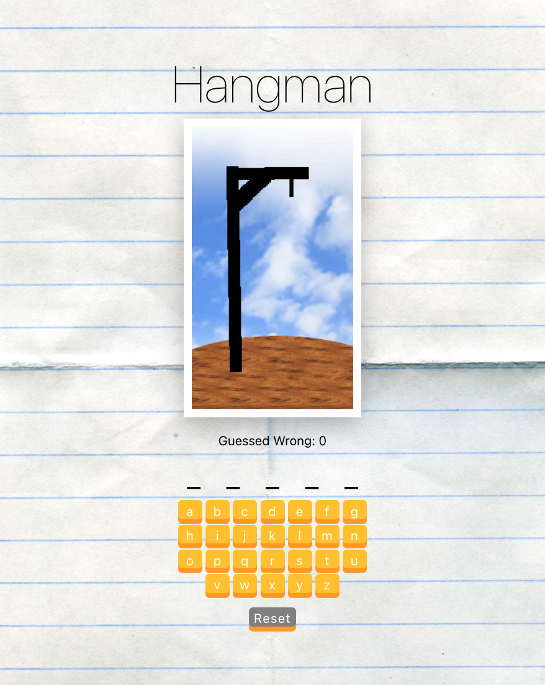
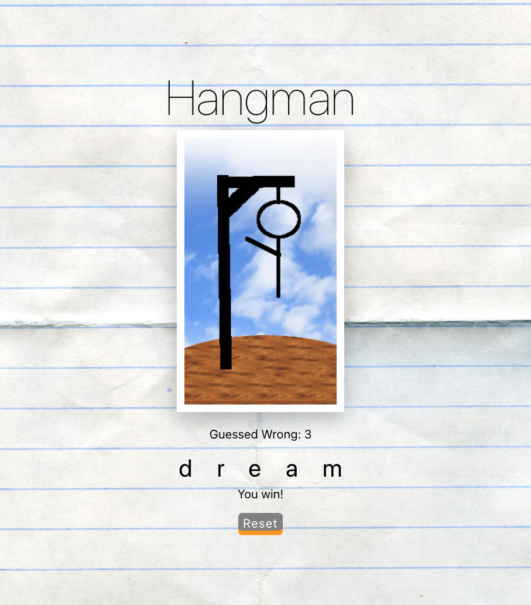
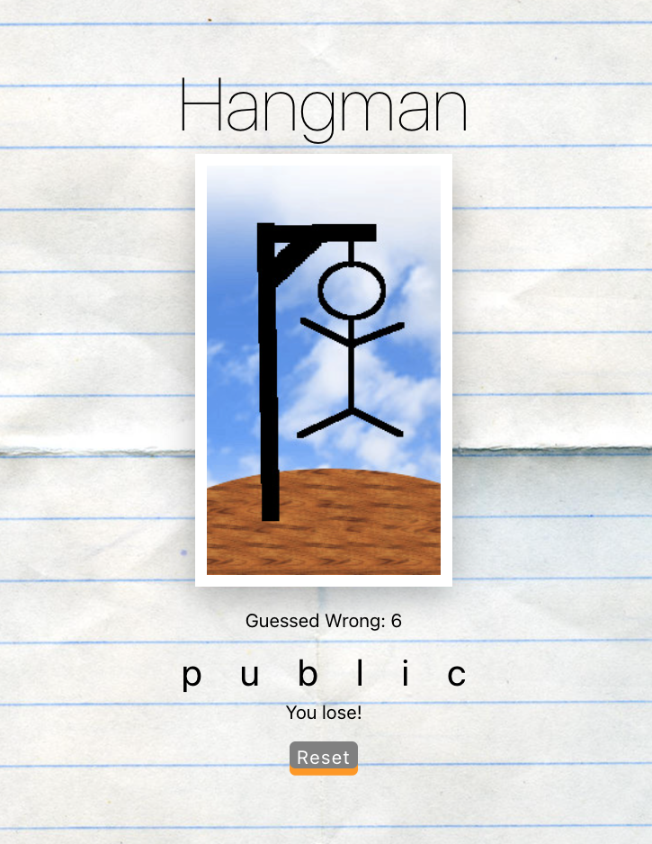

# Hangman Project

A Hangman application created with Create React App where user guesses the answer word via clicking the available letters. With every wrong guess, a figure is displayed until you either win or lose.

## Final Product

### Initial Starting View:

### Winning View:

### Losing View:

## Getting Started

1. Install dependencies using the `npm install` command.
2. Start the web server using the `npm start` command. The app will be served at <http://localhost:3000/>.
3. Go to <http://localhost:3000/> in your browser.

## Dependencies

- create react app
